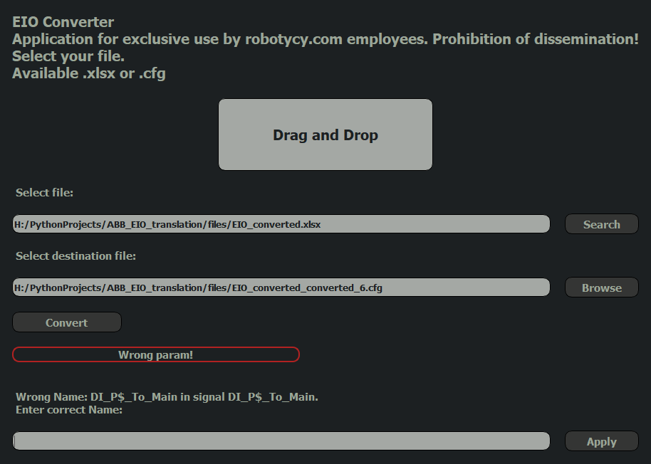

<h2>EIO_Converter</h2> 

Application to convert:  
 - EIO.cfg -> Excel  
 - Excel -> EIO.cfg   
    
Application validate all fields in input file. After detecting some error application show the reason and place to input correct value. 
    
Converted files are ready to open or load to robot controller.
Available extensions : .xlsx and .cfg

You can set destination file to existing file and override it.
During conversion to existing EIO.cfg is available: 
 - override all file  
 - override all signals  
 - append signals to existing  

After error detection in user input, the application show information label and place 
where user can enter new correct value.

